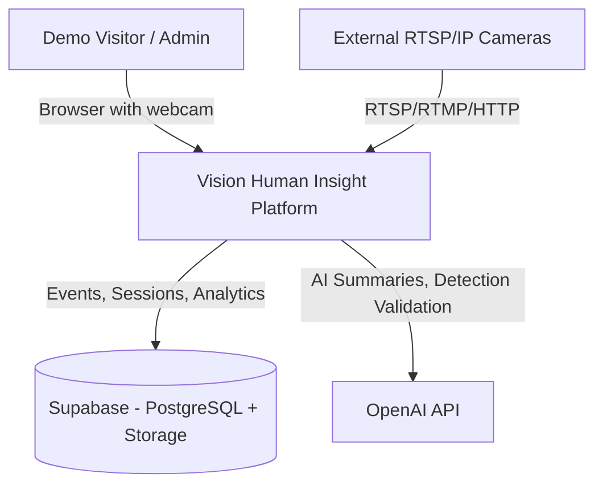
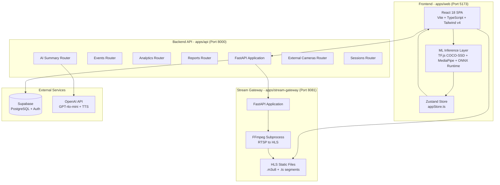
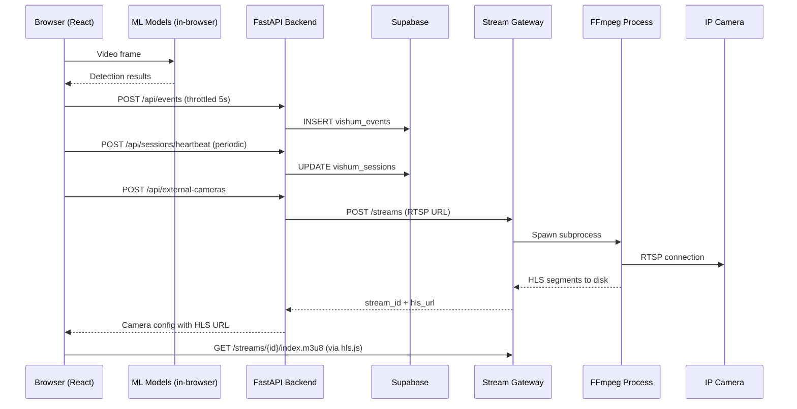

# Architecture Review: Vision Human Insight

> **Date:** 2026-04-05
> **Reviewer:** NXT Architect v3.8.0
> **Status:** Complete
> **Project:** vision-human-insight (vision-aiagentek v1.0.0)

---

## 1. System Context (C4 Level 1)



Vision Human Insight is a real-time computer vision platform that detects persons, faces, emotions, objects, and activities from browser webcams and external IP cameras. It targets demo/exhibition scenarios with session-based access control, an admin panel, and AI-powered analytics summaries.

---

## 2. Container Diagram (C4 Level 2)



---

## 3. Tech Stack Assessment

| Layer | Technology | Version | Assessment |
|-------|-----------|---------|------------|
| **Frontend Framework** | React | 18.3.1 | Stable, good choice |
| **State Management** | Zustand | 4.5.2 | Lightweight, appropriate for this scale |
| **Build Tool** | Vite | 5.2.0 | Fast, modern, well-suited |
| **Styling** | Tailwind CSS | 4.1.0 | v4 is still maturing; monitor breaking changes |
| **Charts** | Recharts | 2.12.0 | Adequate for dashboard needs |
| **Animations** | Framer Motion | 11.0.8 | Good, but heavy for a performance-sensitive app |
| **Routing** | React Router | 6.26.0 | Standard choice |
| **ML - Objects** | TF.js COCO-SSD | 2.2.3 | Functional but limited (80 COCO classes) |
| **ML - Faces** | MediaPipe Tasks Vision | 0.10.9 | Good, purpose-built |
| **ML - ONNX** | onnxruntime-web | 1.19.2 | Available but usage unclear |
| **Video Streaming** | hls.js | 1.5.7 | Solid HLS player |
| **Backend** | FastAPI | >=0.111.0 | Excellent choice for async Python API |
| **Database Client** | supabase-py | >=2.24.0 | Official SDK |
| **AI Integration** | OpenAI SDK | >=1.35.0 | GPT-4o-mini for cost efficiency |
| **Stream Conversion** | FFmpeg (subprocess) | System | Functional but brittle process management |
| **Container Runtime** | Docker Compose | N/A | Appropriate for dev; needs production hardening |

---

## 4. Monorepo Structure Analysis

```
vision-human-insight/
  package.json              # Root - npm workspaces
  apps/
    web/                    # React SPA (Vite)
    api/                    # FastAPI backend (Python)
    stream-gateway/         # FFmpeg RTSP-to-HLS gateway (Python)
  packages/
    shared/                 # Placeholder - NOT actively used
  infra/
    docker-compose.yml      # Dev orchestration (api + stream-gateway)
    supabase/               # SQL setup scripts
  docs/                     # Documentation
  scripts/                  # Setup scripts
```

### Observations

- **Workspace configuration**: The root `package.json` declares npm workspaces (`apps/*`, `packages/*`), but the Python services (api, stream-gateway) are not npm packages. This means the monorepo tooling only truly benefits `apps/web`.
- **Shared package is a no-op**: `packages/shared/` exists but contains no shared code. TypeScript types are duplicated between frontend (`types.ts`) and backend (`models.py`) with no synchronization mechanism.
- **No monorepo orchestrator**: There is no Turborepo, Nx, or similar tool. The `dev:api` script simply shells into uvicorn. Cross-service coordination relies on manual commands.
- **Missing stream-gateway in npm scripts**: There is no `dev:stream-gateway` script in the root `package.json`.

---

## 5. Frontend Architecture Deep Dive

### 5.1 Application Structure

```
apps/web/src/
  App.tsx                   # Router + layout (4 routes)
  main.tsx                  # Entry point
  store/appStore.ts         # Single Zustand store (~820 lines)
  types.ts                  # All TypeScript types
  pages/
    LivePage.tsx            # Real-time camera + ML inference
    DashboardPage.tsx       # Historical analytics
    SettingsPage.tsx        # Configuration
    AdminPage.tsx           # Session management
  components/               # UI components
  lib/
    supabase.ts             # API client (HTTP to backend)
    externalCameras.ts      # External cameras API client
    sessions.ts             # Session management API client
    ml/
      processors.ts         # ML orchestration
      models/               # Model-specific wrappers
  utils/                    # Logger, helpers
```

### 5.2 State Management Assessment

The Zustand store (`appStore.ts`, 820+ lines) is the single source of truth for the entire application. It manages:

- Privacy consent state
- Application configuration (model thresholds, FPS, resolution)
- Performance presets with auto-adjustment logic
- Multi-camera state (configs, detections, runtime state)
- Session management (demo sessions, admin auth)
- External camera synchronization
- Event history (last 100 events)
- Aggregated detection computations
- Legacy compatibility layer

**Risk: Monolithic store.** At 820+ lines with deeply interleaved concerns, this store handles too many responsibilities. The auto-performance adjustment logic embedded inside `updateCameraDetection` is particularly concerning -- it executes on every detection update and modifies camera configs as a side effect.

### 5.3 ML Processing Pipeline

The frontend performs all ML inference in-browser:

1. **COCO-SSD** (TensorFlow.js): Object detection across 80 COCO classes
2. **MediaPipe Face Detection**: Face detection with landmarks
3. **MediaPipe Pose**: Person/pose detection
4. **Emotion inference**: Derived from face landmarks (heuristic or lightweight model)
5. **Activity classification**: Derived from pose data

Processing happens per-camera with per-camera state tracking. There is a global model loading phase before inference begins.

**Risk: Main thread contention.** ML inference competes with UI rendering. There is no Web Worker offloading visible in the architecture. With up to 3 simultaneous cameras, this creates significant frame drop risk.

### 5.4 Communication with Backend

The frontend communicates with the backend exclusively via REST HTTP calls through wrapper functions in `lib/supabase.ts`, `lib/externalCameras.ts`, and `lib/sessions.ts`. There is:

- **No WebSocket or SSE channel** for real-time server-to-client updates
- **No retry/queue mechanism** for failed event insertions
- A **basic 5-second throttle** on event insertion to prevent flooding
- The file `lib/supabase.ts` is misleadingly named -- it actually calls the FastAPI backend, not Supabase directly

---

## 6. Backend Architecture Deep Dive

### 6.1 API Router Structure

| Prefix | Router | Responsibility |
|--------|--------|---------------|
| `/api/events` | events.py | CRUD for detection events |
| `/api/analytics` | analytics.py | Health summaries, trends |
| `/api/reports` | reports.py | Report generation |
| `/api/ai` | ai_summary.py | OpenAI-powered summaries + detection validation |
| `/api/external-cameras` | external_cameras.py | CRUD + stream lifecycle for IP cameras |
| `/api/sessions` | sessions.py | Demo session init, heartbeat, admin panel |

### 6.2 Data Access Pattern

All routers use Supabase Python SDK as the data access layer. The pattern is consistent:

```python
def get_supabase() -> Client:
    return get_supabase_client()

# Used via FastAPI Depends()
supabase: Client = Depends(get_supabase)
```

The Supabase client is initialized at module import time as a singleton using the **service role key** (full admin access). This means:

- **No Row-Level Security (RLS) enforcement** from the backend -- all queries bypass RLS
- **No per-user authentication** -- the `user_id` field defaults to `"anonymous"`
- The client is created once at startup; there is no connection pooling or circuit-breaking

### 6.3 Session Management

The sessions system (`sessions.py`) implements a demo-oriented access control model:

- Sessions are initialized with optional name/email/plan
- Heartbeats maintain session liveness (cameras, FPS, tokens used)
- Admin endpoints allow disconnect, ban, and limit actions
- IP/email-based ban checking prevents re-registration
- Admin authentication uses bcrypt password hashing against a `vishum_admin_users` table
- Admin authorization uses a static `ADMIN_API_TOKEN` passed via `x-admin-token` header

### 6.4 AI Integration

The `ai_summary.py` router provides three endpoints:

1. **generate-summary**: Sends raw event data to GPT-4o-mini for natural language analysis
2. **generate-voice-description**: OpenAI TTS (writes to `/tmp/` -- not production-safe)
3. **validate-detections**: Sends base64 images to GPT-4o-mini Vision for false positive filtering

**Risk: No cost controls.** There is no rate limiting, token budget tracking, or caching for OpenAI calls. A malicious or heavy user could generate significant API costs.

---

## 7. Stream Gateway Architecture

The Stream Gateway (`apps/stream-gateway/main.py`) is a lightweight FastAPI service that:

1. Receives RTSP/RTMP/HTTP source URLs via POST `/streams`
2. Spawns an FFmpeg subprocess per stream to transcode into HLS
3. Serves the resulting `.m3u8` and `.ts` segment files as static assets
4. Manages stream lifecycle (start, stop, status) via REST endpoints

### Process Management

```python
STREAM_PROCESSES: Dict[str, StreamProcess] = {}  # In-memory process registry
```

Streams are tracked in a Python dictionary. FFmpeg runs as a child subprocess with `signal.SIGTERM` for graceful shutdown and `SIGKILL` as fallback.

**Risk: No process supervision.** If FFmpeg crashes, there is no automatic restart. If the gateway process restarts, all stream references are lost (orphan FFmpeg processes). There is no health monitoring for individual streams.

**Risk: CORS wildcard.** The gateway uses `allow_origins=["*"]` which is appropriate for HLS segment serving but could be tightened.

---

## 8. Communication Patterns



### Key Communication Characteristics

| Path | Protocol | Pattern | Auth |
|------|----------|---------|------|
| Browser -> API | HTTP REST | Request/Response | None (anonymous) |
| Browser -> Stream Gateway | HTTP GET | Polling (HLS) | None |
| API -> Supabase | HTTP REST | Request/Response | Service Role Key |
| API -> Stream Gateway | HTTP REST | Request/Response | None |
| API -> OpenAI | HTTP REST | Request/Response | API Key |
| Browser -> ML Models | In-process | Synchronous | N/A |

---

## 9. Database Schema Summary

| Table | Purpose | Key Fields |
|-------|---------|------------|
| `vishum_events` | Detection events | id, user_id, event_type, camera_id, payload (JSONB), created_at |
| `vishum_external_cameras` | IP camera registry | id, user_id, name, source_url, stream_id, hls_url, status |
| `vishum_sessions` | Demo session tracking | session_id, name, email, plan, ip_address, status, tokens_used |
| `vishum_session_events` | Session audit log | session_id, event_type, payload, created_at |
| `vishum_admin_users` | Admin credentials | username, password_hash |

All tables use `gen_random_uuid()` for primary keys and have appropriate indexes (user_id, event_type, camera_id, created_at, GIN on JSONB payload).

---

## 10. Architectural Risks

### RISK-01: No Authentication or Authorization (HIGH)

**Current state:** All API endpoints (except admin) accept requests with no authentication. The `user_id` is always `"anonymous"`. The frontend communicates directly with the backend without any token or session validation on most endpoints.

**Impact:** Any client can read all events, inject fake events, or consume AI endpoints. The session system provides identity but does not enforce authorization on other routes.

**Recommendation:** Implement Supabase Auth or a lightweight JWT scheme. At minimum, require `session_id` on all write endpoints and validate session status.

### RISK-02: Monolithic Zustand Store (MEDIUM)

**Current state:** A single 820+ line store file manages all application state including camera configs, ML detections, session state, admin auth, and performance auto-tuning.

**Impact:** Difficult to test, reason about, and maintain. Side effects in `updateCameraDetection` (auto-performance tuning) create hidden coupling. Any change risks unintended state mutations.

**Recommendation:** Split into domain slices: `cameraStore`, `sessionStore`, `detectionStore`, `configStore`. Zustand supports this via separate stores or the `slice` pattern.

### RISK-03: ML Inference on Main Thread (MEDIUM-HIGH)

**Current state:** All TensorFlow.js and MediaPipe inference runs on the main thread. With up to 3 cameras processing simultaneously, this competes directly with React rendering.

**Impact:** UI jank, dropped frames, unresponsive interactions during heavy inference. The auto-performance downgrade mechanism is a workaround, not a solution.

**Recommendation:** Move ML inference to Web Workers using `OffscreenCanvas`. TensorFlow.js supports worker-based inference. This would decouple ML computation from UI rendering.

### RISK-04: FFmpeg Process Management (MEDIUM)

**Current state:** The Stream Gateway tracks FFmpeg processes in an in-memory dictionary. There is no supervision, restart logic, or persistence of stream state.

**Impact:** If the gateway restarts, all stream references are lost. Crashed FFmpeg processes are not detected until the next status check. Orphan processes can accumulate.

**Recommendation:** Add a process health monitor (periodic poll of `process.poll()`). Consider using a process supervisor or recording stream state in Supabase so it can be reconstructed after restart.

### RISK-05: No Rate Limiting (MEDIUM)

**Current state:** No rate limiting exists on any endpoint. The only throttle is a client-side 5-second minimum between event insertions.

**Impact:** Vulnerable to abuse -- especially the OpenAI endpoints which incur direct cost. Bulk event insertion or repeated AI summary requests could degrade service or accumulate charges.

**Recommendation:** Add FastAPI rate limiting middleware (e.g., `slowapi`). Implement per-session quotas for AI endpoints. The session system already tracks `tokens_used` but does not enforce limits at the API level.

### RISK-06: Service Role Key Exposure Risk (HIGH)

**Current state:** The backend uses `SUPABASE_SERVICE_ROLE_KEY` which bypasses all Row-Level Security. The key is loaded from environment variables and used for all queries.

**Impact:** If the backend is compromised, the attacker has full database access. There is no defense-in-depth at the database layer.

**Recommendation:** For read-heavy paths, use the `anon` key with proper RLS policies. Reserve the service role key only for admin operations that truly require elevated access.

### RISK-07: Missing Type Synchronization (LOW-MEDIUM)

**Current state:** TypeScript types (`apps/web/src/types.ts`) and Pydantic models (`apps/api/models.py`) are maintained manually with no code generation or shared contract.

**Impact:** Drift between frontend and backend type definitions leads to runtime errors that TypeScript cannot catch.

**Recommendation:** Generate TypeScript types from the FastAPI OpenAPI spec (e.g., `openapi-typescript`), or use a shared schema definition (JSON Schema, protobuf).

### RISK-08: Misleading File Names (LOW)

**Current state:** `apps/web/src/lib/supabase.ts` does not communicate with Supabase. It is a REST client for the FastAPI backend. The name is a legacy artifact.

**Impact:** Developer confusion; new contributors will misunderstand the data flow.

**Recommendation:** Rename to `apiClient.ts` or `backendApi.ts`.

---

## 11. Improvement Opportunities

### OPP-01: Add Health Check Aggregation

Currently, the only health check is `/api/health` which pings Supabase. Add an aggregated health endpoint that checks:
- Supabase connectivity
- Stream Gateway reachability
- OpenAI API key validity
- Active stream count and health

### OPP-02: Implement Event Batching

The frontend sends individual events with a 5-second throttle. This loses events during high-activity periods. Implement a client-side batch buffer that accumulates events and sends them in bulk (e.g., every 10 seconds or when the buffer reaches N items).

### OPP-03: Add Structured Logging

Both backend services use `print()` for error logging. Adopt structured logging (e.g., `structlog` or `loguru`) with correlation IDs tied to session_id for traceability.

### OPP-04: Introduce API Versioning

All endpoints are under `/api/` with no version prefix. As the product evolves, breaking changes will be difficult to manage. Move to `/api/v1/`.

### OPP-05: Separate Admin Backend

The admin endpoints (`/api/sessions/admin/*`) share the same FastAPI application as public-facing endpoints. Consider a separate admin service or at minimum a dedicated router prefix (`/api/admin/`) with middleware-level token validation.

### OPP-06: Add Integration Tests

There are no test files in the repository. Add at minimum:
- API endpoint tests using FastAPI TestClient
- Store unit tests for Zustand state transitions
- E2E smoke tests for the session flow

### OPP-07: Production-Ready Docker Compose

The current `docker-compose.yml` is development-oriented (volume mounts, `--reload`). Create a `docker-compose.prod.yml` with:
- Multi-stage builds for smaller images
- Resource limits
- Health checks
- Log drivers
- No volume mounts of source code

### OPP-08: Consider WebSocket for Real-Time Updates

The admin panel currently requires polling to see session updates. A WebSocket or SSE channel from the backend would enable real-time dashboards without polling overhead.

---

## 12. Architecture Decision Records

### ADR-001: Edge-First ML Inference

- **Status:** Accepted (implemented)
- **Context:** The platform needs real-time person/face/emotion/object detection
- **Decision:** Run ML models in the browser using TF.js, MediaPipe, and ONNX Runtime rather than server-side inference
- **Consequences:**
  - Positive: No GPU server costs, low latency, works offline once models load
  - Positive: Privacy -- raw video never leaves the device
  - Negative: Limited by client hardware; mobile/low-end devices struggle
  - Negative: Model size limited by download bandwidth
  - Risk: Main thread contention (see RISK-03)

### ADR-002: Supabase as Backend Database

- **Status:** Accepted (implemented)
- **Context:** Need a managed PostgreSQL database with real-time capabilities
- **Decision:** Use Supabase for data persistence, accessed via Python SDK from the backend
- **Consequences:**
  - Positive: Managed infrastructure, built-in auth (unused), real-time subscriptions (unused)
  - Positive: JSONB support for flexible event payloads
  - Negative: Vendor lock-in to Supabase-specific SDK patterns
  - Risk: Service role key bypasses RLS (see RISK-06)

### ADR-003: FFmpeg Subprocess for Stream Transcoding

- **Status:** Accepted (implemented)
- **Context:** Need to convert RTSP/IP camera streams to browser-playable format
- **Decision:** Spawn FFmpeg as a subprocess from a FastAPI service, producing HLS segments
- **Consequences:**
  - Positive: FFmpeg is battle-tested, supports virtually all input formats
  - Positive: HLS is widely supported in browsers via hls.js
  - Negative: Subprocess management is fragile (see RISK-04)
  - Negative: No transcoding flexibility at runtime (codec params are fixed)

### ADR-004: Session-Based Access Control (Demo Model)

- **Status:** Accepted (implemented)
- **Context:** The platform is primarily used for demos/exhibitions with visitor tracking
- **Decision:** Implement a lightweight session system with init/heartbeat/admin lifecycle instead of full user authentication
- **Consequences:**
  - Positive: Low friction for demo visitors (no signup required)
  - Positive: Admin can monitor, limit, and ban sessions in real time
  - Negative: No real authentication; session_id is the only identity
  - Risk: Other API endpoints lack authorization (see RISK-01)

---

## 13. Summary Scorecard

| Dimension | Score | Notes |
|-----------|-------|-------|
| **Modularity** | 6/10 | Clear service boundaries, but monolithic store and no shared types |
| **Scalability** | 4/10 | Single-instance design; no horizontal scaling path for gateway |
| **Security** | 3/10 | No auth on most endpoints; service role key; no rate limiting |
| **Maintainability** | 6/10 | Clean code style, but large store and no tests |
| **Observability** | 2/10 | No structured logging, metrics, or tracing |
| **Reliability** | 4/10 | No retry logic, no circuit breakers, fragile FFmpeg management |
| **Developer Experience** | 7/10 | Good monorepo layout, clear naming, Docker setup works |
| **Performance** | 5/10 | Auto-performance tuning is clever but ML on main thread is limiting |

**Overall Assessment:** The architecture is well-structured for a demo/MVP product. The tech choices are sound (React + Zustand, FastAPI, Supabase, FFmpeg/HLS). The most pressing concerns are security (authentication, rate limiting, key management), the oversized Zustand store, and the lack of observability. Moving toward production would require addressing RISK-01, RISK-05, and RISK-06 as priorities.

---

*NXT Architect -- Structure that Scales, Decisions that Endure*
